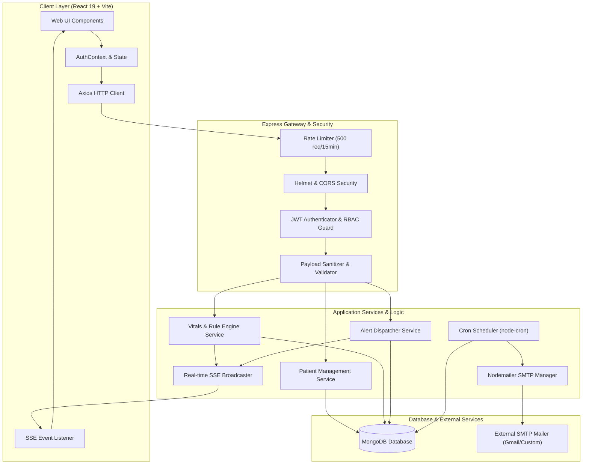

# 🏥 Manual-RPM — Remote Patient Monitoring System


---

> **Manual-RPM** is an enterprise-grade, full-stack Remote Patient Monitoring solution engineered for hospitals, clinical wards, and healthcare professionals. It resolves the challenge of critical care surveillance by delivering real-time patient vitals tracking, dynamic threshold-monitoring rule engines, automated background reminders, instant Server-Sent Events (SSE) alerts, and comprehensive clinical audit logging—empowering medical teams to intervene proactively and improve patient outcomes.

---

## ⚡ Key Features & Technical Highlights

- 📡 **Real-Time Event Streaming**: Architected with Server-Sent Events (SSE) to push instant alert notifications to clinical web interfaces without expensive client polling overhead.
- 🩺 **Intelligent Vitals & Rule Engine**: Evaluates patient physiological data against specialized templates (General, Cardiac, Diabetic) and trigger rule configurations to generate severity-tiered alerts automatically.
- 🔐 **Defense-in-Depth & Role-Based Security**: Secured with stateless JWT authentication, fine-grained Role-Based Access Control (Admin, Doctor, Nurse, Coordinator), HTTP security headers via Helmet, payload sanitization, and tiered rate limiting.
- 📊 **Visual Analytics & Clinical Reporting**: Embeds responsive 7-day trend visualizers via Recharts with client-side PDF (`jsPDF-AutoTable`) and CSV report generation engines.
- ⏰ **Automated Cron Scheduling & Notifications**: Powered by `node-cron` background workers coupled with Nodemailer SMTP integrations for automated medication reminders with quiet-hours support.
- 🧪 **Dual-Layer Comprehensive Testing**: Verified by client component and utility tests using Vitest (57 passing tests) and server endpoint integration tests powered by Jest.

---

## 📦 Tech Stack Matrix

| Layer | Technology | Purpose |
| :--- | :--- | :--- |
| **Frontend UI** | [React 19](file:///Users/karthikyernana/karthikyernana%20/mernpro/frontend/package.json#L22) + [Vite 7](file:///Users/karthikyernana/karthikyernana%20/mernpro/frontend/package.json#L45) | Component-driven, ultra-fast client single-page application |
| **Routing & Navigation** | [React Router v7](file:///Users/karthikyernana/karthikyernana%20/mernpro/frontend/package.json#L25) | Client-side routing with role-protected route boundaries |
| **Styling & Motion** | [TailwindCSS 3.4](file:///Users/karthikyernana/karthikyernana%20/mernpro/frontend/package.json#L44) + [Framer Motion](file:///Users/karthikyernana/karthikyernana%20/mernpro/frontend/package.json#L17) | Utility-first responsive design, glassmorphic UI, smooth micro-interactions |
| **Data Visualization** | [Recharts 3.6](file:///Users/karthikyernana/karthikyernana%20/mernpro/frontend/package.json#L26) | Interactive, multi-metric patient vitals time-series charting |
| **Document & Share** | [jsPDF](file:///Users/karthikyernana/karthikyernana%20/mernpro/frontend/package.json#L18) + [QRCode](file:///Users/karthikyernana/karthikyernana%20/mernpro/frontend/package.json#L21) | Client-side clinical PDF report compilation and secure QR code generation |
| **Backend Runtime** | [Node.js (v18+)](file:///Users/karthikyernana/karthikyernana%20/mernpro/backend/package.json#L7) + [Express 5](file:///Users/karthikyernana/karthikyernana%20/mernpro/backend/package.json#L30) | Scalable REST API server with middleware architecture |
| **Database & ODM** | [MongoDB 9](file:///Users/karthikyernana/karthikyernana%20/mernpro/backend/package.json#L35) + [Mongoose](file:///Users/karthikyernana/karthikyernana%20/mernpro/backend/package.json#L35) | Document database storing patient records, vitals history, and audit logs |
| **Auth & Security** | [JWT](file:///Users/karthikyernana/karthikyernana%20/mernpro/backend/package.json#L34), [bcryptjs](file:///Users/karthikyernana/karthikyernana%20/mernpro/backend/package.json#L27), [Helmet](file:///Users/karthikyernana/karthikyernana%20/mernpro/backend/package.json#L33) | Password hashing, token authentication, rate limiting, and HTTP hardening |
| **Background Processing** | [node-cron](file:///Users/karthikyernana/karthikyernana%20/mernpro/backend/package.json#L37) + [Nodemailer](file:///Users/karthikyernana/karthikyernana%20/mernpro/backend/package.json#L38) | Scheduled reminder execution and automated email notification dispatch |
| **Test Automation** | [Vitest](file:///Users/karthikyernana/karthikyernana%20/mernpro/frontend/package.json#L46) & [Jest](file:///Users/karthikyernana/karthikyernana%20/mernpro/backend/package.json#L43) | Unit testing, DOM component testing, and REST API integration testing |

---

## 🏗️ System Architecture

The diagram below illustrates the end-to-end data flow and architectural interaction between the client web layer, Express API server, background services, and storage engines:



---

## 🗺️ Categorized Feature Overview

### 1. 📋 Patient & Clinical Care Management
- **Dashboard Overview** (`/dashboard`): Real-time ward metrics, recent alerts counter, active patient count, and system status widgets.
- **Patient Registry** (`/patients`): Full CRUD workflow, ward/bed assignments, primary physician tracking, and quick filter search.
- **Detailed Patient File** (`/patients/:id`): Complete medical history, admission/discharge state machine, historical vitals charts, and rule configuration.
- **Secure Link Sharing**: Public view link (`/public/share/:token`) protected by expiring JWT tokens and downloadable QR codes for temporary clinical access.

### 2. 🩺 Vitals Monitoring & Alert Engine
- **Vitals Logger**: Support for dynamic templates (General, Cardiac, Diabetic) capturing HR, BP, SpO2, Temperature, Blood Glucose, and Respiratory Rate.
- **Alert Center** (`/alerts`): Centralized list of auto-generated high, medium, and low severity alerts with status transitions (`NEW` -> `ACKNOWLEDGED` -> `RESOLVED`).
- **Real-Time Push**: Server-Sent Events notify online nurses and doctors immediately when a critical threshold is breached.

### 3. ⏰ Reminders & Email Notifications
- **Automated Scheduling** (`/reminders`): Configurable medication and check-up reminders with support for quiet-hours suppression.
- **SMTP Notifications**: Automated email dispatches formatted with clean HTML templates.

### 4. 🔒 Authentication, Security & Governance
- **Role-Based Auth** (`/login`): Secure authentication supporting `Admin`, `Doctor`, `Nurse`, and `Coordinator` roles.
- **User Administration** (`/admin/users`): Managed registration flow (public registration disabled; accounts created securely by Administrators).
- **Audit Logging** (`/admin/audit-logs`): Comprehensive event logging capturing user ID, IP address, exact action, timestamp, and target resource.
- **System Settings** (`/settings`): Dynamic ward definitions, bed management, and global alert defaults.

---

## 📁 Project Directory Tree

```
mernpro/
├── backend/
│   ├── src/
│   │   ├── config/             # Database connection & env configurations
│   │   ├── middleware/         # Auth, RBAC, error handler, rate limiters
│   │   ├── models/             # Mongoose schemas (Patient, Vitals, Alert, Reminder, User, AuditLog, SystemSetting)
│   │   ├── routes/             # API route controllers (vitals, alert, patient, auth, admin, etc.)
│   │   ├── services/           # Email service, rule engine, scheduler
│   │   ├── utils/              # SSE broadcaster, logger, formatters
│   │   └── server.js           # Express app initialization & server entry
│   ├── scripts/                # Database seeding & administrative scripts
│   ├── tests/                  # API integration & unit test suites (Jest)
│   ├── .env.example            # Environment configuration template
│   ├── jest.config.js          # Jest runner configuration
│   └── package.json            # Node backend dependencies & scripts
├── frontend/
│   ├── src/
│   │   ├── assets/             # Branding icons & image resources
│   │   ├── components/         # Modular UI components (Navbar, Modal, SharePatientModal, etc.)
│   │   ├── context/            # AuthContext & global React providers
│   │   ├── pages/              # Primary route views (Dashboard, Patients, PatientDetail, Alerts, etc.)
│   │   ├── services/           # Axios instance & API endpoint services
│   │   ├── styles/             # Tailwind & custom CSS utility declarations
│   │   ├── utils/              # Data validators, formatters, PDF/CSV generators
│   │   ├── App.jsx             # Main routing & layout controller
│   │   └── main.jsx            # React root mount point
│   ├── tests/                  # Vitest UI component & utility test suites
│   ├── .env.example            # Frontend environment template
│   ├── vite.config.js          # Vite bundler configuration
│   └── package.json            # Frontend dependencies & scripts
├── setup-env.sh                # Automated setup script (macOS/Linux)
├── setup-env.bat               # Automated setup script (Windows)
└── README.md                   # System documentation
```

---

## 🧪 Testing & Code Quality

The project maintains high code reliability across both frontend and backend modules with comprehensive unit and integration testing:

### Client Unit & Integration Test Suite (Vitest)

```bash
 RUN  v4.0.16 /frontend

 ✓ tests/utils/validation.test.js (51 tests)
 ✓ tests/pages/LoginPage.test.jsx (4 tests)
 ✓ tests/components/Navbar.test.jsx (2 tests)

 Test Files  3 passed (3)
      Tests  57 passed (57)
   Duration  838ms
```

To run the test suites locally:

```bash
# Run Frontend Tests (Vitest)
cd frontend
npm test

# Run Backend Integration Tests (Jest)
cd backend
npm test
```

---

## 🚀 Getting Started & Setup Guide

### 📋 Prerequisites

Ensure your development environment meets the following requirements:
- **Node.js**: `v18.0.0` or higher
- **npm**: `v9.0.0` or higher
- **MongoDB**: Local instance running on `mongodb://localhost:27017` or a **MongoDB Atlas** connection URI
- **SMTP Account** *(Optional)*: Gmail App Password or custom SMTP server for email notifications

---

### ⚡ Quick Automated Setup

Run the interactive environment setup script to automatically copy `.env.example` files into place:

**macOS / Linux:**
```bash
chmod +x setup-env.sh
./setup-env.sh
```

**Windows:**
```cmd
setup-env.bat
```

---

### 🛠️ Manual Step-by-Step Installation

#### 1️⃣ Clone the Repository
```bash
git clone https://github.com/your-username/manual-rpm.git
cd manual-rpm
```

#### 2️⃣ Configure Backend Environment
Navigate to the `backend` directory, install dependencies, and create `.env`:

```bash
cd backend
npm install
```

Create `backend/.env` with the following variables:

```env
# Server Configuration
PORT=5001
NODE_ENV=development
FRONTEND_URL=http://localhost:5173

# Database Connection
MONGODB_URI=mongodb://localhost:27017/manual-rpm

# JWT Security Credentials
JWT_SECRET=your_super_secret_jwt_access_key_here
JWT_EXPIRY=1h

# SMTP Email Notification Service (Optional)
EMAIL_HOST=smtp.gmail.com
EMAIL_PORT=587
EMAIL_SECURE=false
EMAIL_USER=your_email_address_here@gmail.com
EMAIL_PASS=your_smtp_app_password_here
```

#### 3️⃣ Seed Administrative User
Run the seeding script to create the initial Administrator account:

```bash
npm run seed:admin
```

#### 4️⃣ Configure Frontend Environment
In a new terminal window, navigate to `frontend`, install dependencies, and set up `.env`:

```bash
cd frontend
npm install
```

Create `frontend/.env`:

```env
VITE_API_BASE_URL=http://localhost:5001/api/v1
```

---

### 🏃 Running Local Development Servers

Start the backend API server and frontend development server concurrently:

```bash
# Terminal 1: Backend API (http://localhost:5001)
cd backend
npm run dev

# Terminal 2: Frontend App (http://localhost:5173)
cd frontend
npm run dev
```

Open your browser and navigate to **`http://localhost:5173`**.

> **Note**: Default Admin Login Credentials created during seeding:
> - **Username**: `admin`
> - **Password**: `Admin@123456`
> *(Be sure to change this password in production environments via the User Settings modal).*
